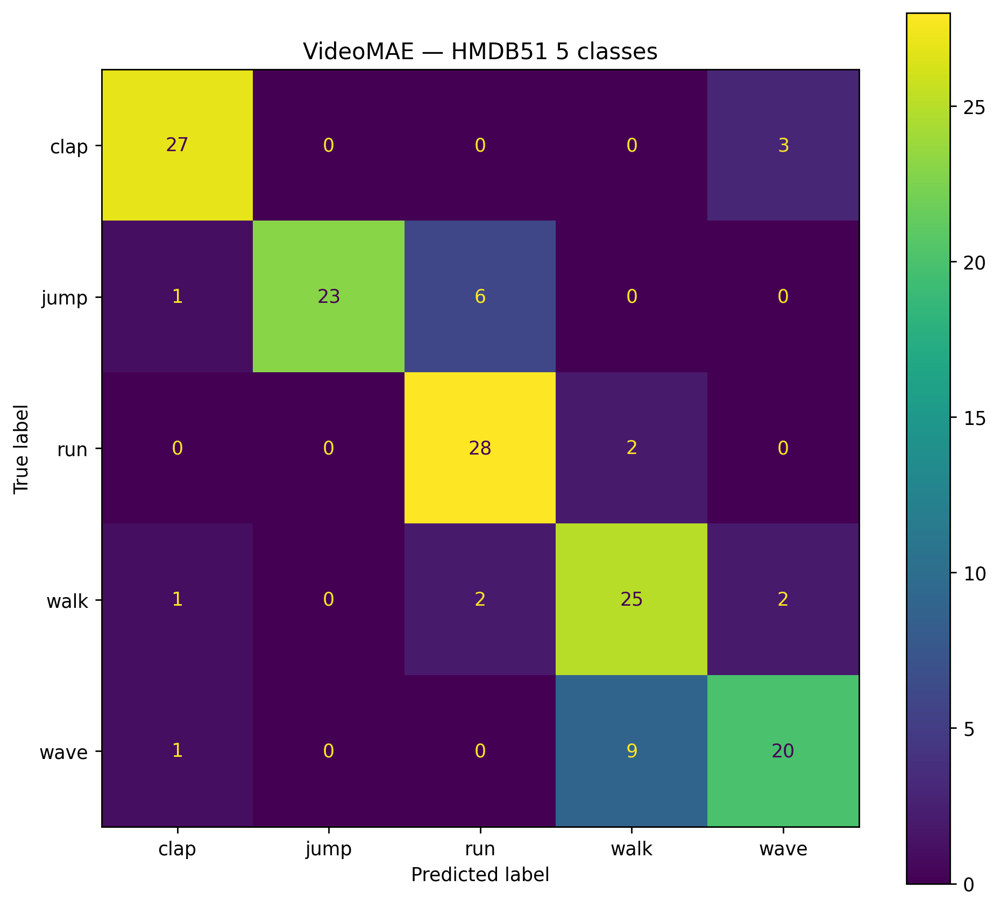
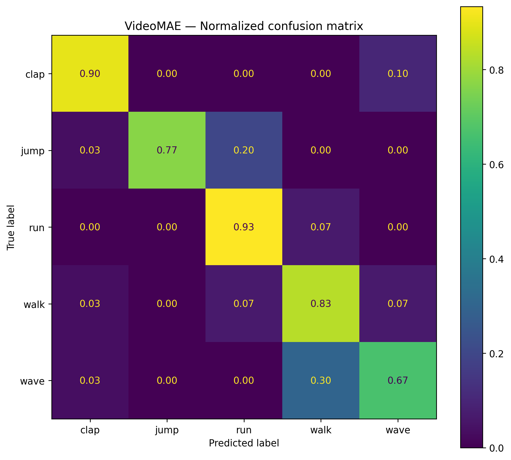
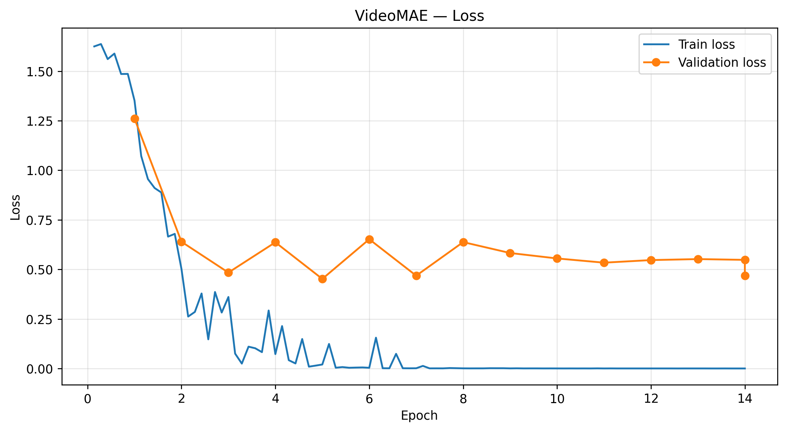
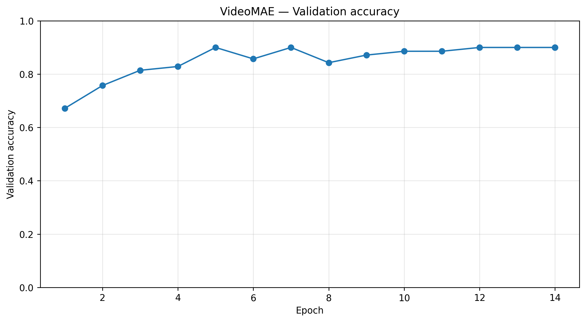
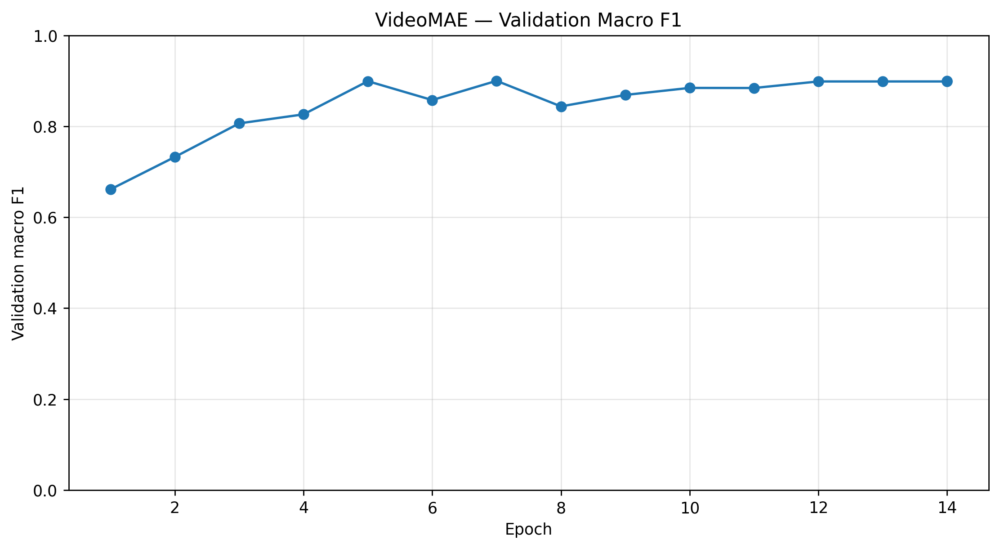

# Video Classification with VideoMAE

This repository contains experiments for **video action classification** using a pretrained **VideoMAE transformer**, together with a simple **autoregressive video generation** experiment based on a CNN + Transformer architecture.

The main task is fine-tuning VideoMAE on a 5-class subset of the **HMDB51** human action recognition dataset.

## Overview

The classification experiment uses:

* Dataset: `Sina272/hmdb51-v2`
* Pretrained model: `MCG-NJU/videomae-base-finetuned-kinetics`
* Framework: PyTorch + Hugging Face Transformers
* Video decoding: PyAV
* Number of classes: 5

The following actions are classified:

```text
clap
jump
run
walk
wave
```

## Results

The fine-tuned VideoMAE model achieves the following performance on the test set:

| Metric          |      Score |
| --------------- | ---------: |
| Accuracy        | **0.8200** |
| Macro F1        | **0.8203** |
| Macro Precision | **0.8344** |
| Macro Recall    | **0.8200** |

The test set contains **150 videos**, with 30 samples for each class.

### Per-class performance

| Class | Precision | Recall | F1-score |
| ----- | --------: | -----: | -------: |
| clap  |    0.9000 | 0.9000 |   0.9000 |
| jump  |    1.0000 | 0.7667 |   0.8679 |
| run   |    0.7778 | 0.9333 |   0.8485 |
| walk  |    0.6944 | 0.8333 |   0.7576 |
| wave  |    0.8000 | 0.6667 |   0.7273 |

## Confusion Matrix



## Normalized Confusion Matrix



## Training Curves

### Loss



### Accuracy



### Macro F1



---

# VideoMAE Classification

The main classification script is:

```text
Video_trans.py
```

It implements the complete video classification pipeline.

## Pipeline

The script:

1. downloads the required subset of HMDB51 from Hugging Face;
2. selects five action classes;
3. loads the official train and test metadata;
4. creates a stratified train/validation split;
5. decodes videos using PyAV;
6. samples frames from each video;
7. applies data augmentation during training;
8. fine-tunes a pretrained VideoMAE model;
9. performs early stopping based on validation Macro F1;
10. evaluates the best model on the test dataset;
11. saves metrics, predictions and plots.

## Model

The experiment uses:

```text
MCG-NJU/videomae-base-finetuned-kinetics
```

The model is initialized from VideoMAE weights pretrained/fine-tuned on Kinetics and adapted to five HMDB51 classes.

The classification head is automatically resized to:

```text
num_labels = 5
```

## Video preprocessing

Each video is decoded using PyAV.

For every sample:

```text
Number of frames: 16
Frame sampling rate: 4
```

For sufficiently long videos, the script samples frames using a temporal stride.

During training, the starting position is randomly selected.

During validation and testing, the temporal crop is deterministic and taken near the center of the video.

Shorter videos are handled using uniformly spaced frame indices.

## Data augmentation

Training videos use random horizontal flipping:

```text
probability = 0.5
```

Validation and test videos are not augmented.

## Training configuration

| Parameter               | Value                                      |
| ----------------------- | ------------------------------------------ |
| Model                   | `MCG-NJU/videomae-base-finetuned-kinetics` |
| Dataset                 | `Sina272/hmdb51-v2`                        |
| Classes                 | 5                                          |
| Frames per video        | 16                                         |
| Frame sample rate       | 4                                          |
| Validation ratio        | 0.20                                       |
| Maximum epochs          | 30                                         |
| Learning rate           | `5e-5`                                     |
| Weight decay            | `0.05`                                     |
| Warmup ratio            | `0.10`                                     |
| LR scheduler            | Cosine                                     |
| Optimizer               | AdamW                                      |
| Training batch size     | 2                                          |
| Evaluation batch size   | 2                                          |
| Gradient accumulation   | 2                                          |
| Early stopping patience | 7                                          |
| Seed                    | 42                                         |

FP16 training is automatically enabled when CUDA is available.

## PyAV stability

Some HMDB51 AVI files may cause PyAV to hang when multiprocessing or automatic threaded decoding is used.

For this reason, the implementation intentionally uses:

```python
dataloader_num_workers = 0
```

and does not enable:

```python
stream.thread_type = "AUTO"
```

Video files are opened using:

```python
av.open(
    video_path,
    mode="r",
    metadata_errors="ignore",
)
```

This configuration improves robustness when processing problematic AVI files.

---

# Installation

Python 3.10+ is recommended.

Create a virtual environment:

```bash
python -m venv .venv
```

Activate it on Linux or WSL:

```bash
source .venv/bin/activate
```

Upgrade pip:

```bash
pip install --upgrade pip
```

Install dependencies:

```bash
pip install \
    torch \
    transformers \
    huggingface-hub \
    av \
    numpy \
    pandas \
    scikit-learn \
    matplotlib \
    opencv-python \
    tqdm
```

For GPU training, install a PyTorch version compatible with your CUDA version.

---

# Running the VideoMAE experiment

Run:

```bash
python Video_trans.py
```

The dataset and pretrained model are downloaded automatically from Hugging Face when required.

Training results are stored in:

```text
videomae_hmdb51_5classes/
```

## Output files

Typical output files include:

```text
videomae_hmdb51_5classes/
├── accuracy_curve.png
├── class_accuracy.png
├── classification_report.txt
├── confusion_matrix.png
├── confusion_matrix_normalized.png
├── f1_curve.png
├── loss_curve.png
├── test_predictions.csv
├── test_split.csv
├── train_split.csv
├── training_history.csv
├── val_split.csv
└── validation_metrics.png
```

The script also saves the best model locally.

Large model files such as:

```text
*.pt
*.pth
*.ckpt
*.safetensors
```

should generally not be committed directly to a regular GitHub repository because they can exceed GitHub's file size limits.

---

## Architecture

The model combines a convolutional encoder, causal Transformer and convolutional decoder:

```text
Input video frames
        ↓
CNN Frame Encoder
        ↓
Latent representations
        ↓
Positional embeddings
        ↓
Causal Transformer
        ↓
Latent prediction
        ↓
CNN Frame Decoder
        ↓
Predicted video frames
```

## Frame Encoder

Each frame is encoded independently using convolutional layers:

```text
64 × 64
   ↓
32 × 32
   ↓
16 × 16
   ↓
8 × 8
   ↓
Latent vector
```

The default latent dimensionality is:

```text
128
```

## Transformer

The temporal model uses a causal Transformer encoder with:

```text
Attention heads: 4
Transformer layers: 3
Latent dimension: 128
```

A causal attention mask prevents the model from using information from future frames.

## Frame Decoder

The predicted latent vectors are transformed back into image frames using transposed convolutions.

The model predicts the next frame for every position in the input sequence.

## Training objective

The model is trained using mean squared error:

```text
MSE(predicted frame, target frame)
```

and the AdamW optimizer.

## Default configuration

| Parameter          |   Value |
| ------------------ | ------: |
| Image size         | 64 × 64 |
| Sequence length    |      15 |
| Context frames     |       5 |
| Training samples   |    3000 |
| Validation samples |     300 |
| Batch size         |      32 |
| Epochs             |      30 |
| Latent dimension   |     128 |
| Transformer heads  |       4 |
| Transformer layers |       3 |
| Learning rate      |  `3e-4` |


# Repository Structure

```text
Video-classification-/
│
├── Video_trans.py
│   └── VideoMAE fine-tuning and HMDB51 classification
│
├── videomae_hmdb51_5classes/
│   ├── evaluation results
│   ├── metrics
│   ├── predictions
│   └── plots
│
├── .gitignore
├── LICENSE
└── README.md
```

---

# Technologies

The project uses:

* Python
* PyTorch
* Hugging Face Transformers
* VideoMAE
* PyAV
* NumPy
* Pandas
* scikit-learn
* Matplotlib
* OpenCV

---

# Dataset

The project uses a subset of HMDB51 available through Hugging Face:

```text
Sina272/hmdb51-v2
```

HMDB51 is a human action recognition dataset containing video clips from multiple action categories.

Only the following classes are used in this experiment:

```text
clap
jump
run
walk
wave
```

---

# Pretrained Model

The pretrained backbone is:

```text
MCG-NJU/videomae-base-finetuned-kinetics
```

VideoMAE is a transformer-based architecture designed for learning spatiotemporal representations from video.

---

# Reproducibility

The default random seed is:

```text
42
```

The seed is applied to:

```text
Python random
NumPy
PyTorch
Hugging Face Transformers
CUDA
```

This improves reproducibility between training runs, although complete numerical reproducibility may still depend on hardware, CUDA and library versions.

---

# License

This project is distributed under the **GNU Affero General Public License v3.0 (AGPL-3.0)**.

See:

```text
LICENSE
```

for the complete license text.

---

# Author

**Bulat Batuev**

GitHub: [@buligar](https://github.com/buligar)
